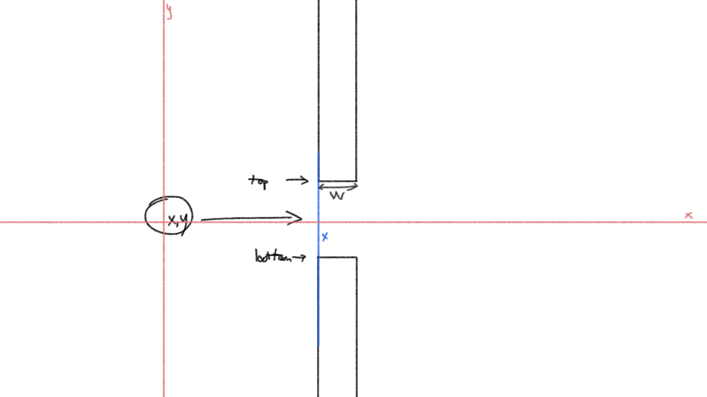

<p align="center"></p>

🎮 A flappy-bird game write with [p5js](https://p5js.org/)

## Running locally

- Install [Node](http://nodejs.org/download/) and [Grunt](http://gruntjs.com/)
- Install the dependencies

```
npm install
```

Then just type on your bash:

```
grunt
```

Open your browser at `http://localhost:8000/`


## Screenshot

<p align="center"></p>

Just a simple game, may contain lots of errors 🤣🤣


